# ieaeceBlog web application

## Tasks: 

* [x] getting started - 5 (https://guides.rubyonrails.org/getting_started.html)
* [x] pagination - 2 (use gem will_paginate and manually at the beginning)
* [x] authentication - 2 (use gem devise)
* [x] authorization - 3 (manually check if this user can change or delete a specific post)
* [x] administrator mode - 1 (manually add column "is_admin" to accounts table and check if user can perform some actions)
* [x] searching - 2 (manually execute query on db and take only posts that have specific word (or its beginning))
* [x] images - 2 (add column for storing link to a photo and use it in view)
* [x] cloud - 2 (store all the photos at Cloudinary)
* [x] filtering by category - 2 (add category column in posts table and show only posts with specific category)
* [x] docker - 3 (last commit, set docker-compose up for the project)

### Extra tasks: 

+ likes (manually create table that storing article_id and account_id)
+ sorting asc/desc by created_at (perform query on a db to order articles by created_at field)

## Total for now: 

​			24 points / 20 + points for extra tasks

# Main page of the blog:

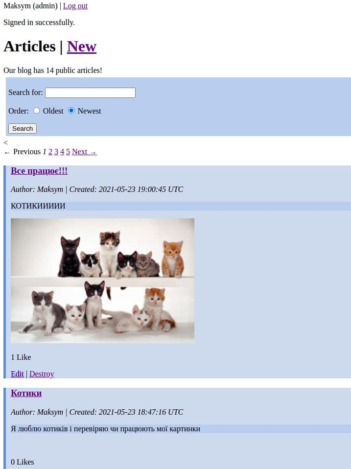

# A lot of screens about my blog

+ Searching, sorting and filtering form + pagination: 

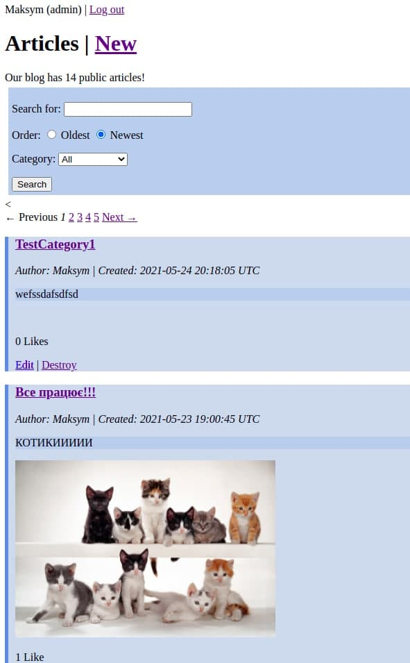

+ Sorting articles asc by created_at

  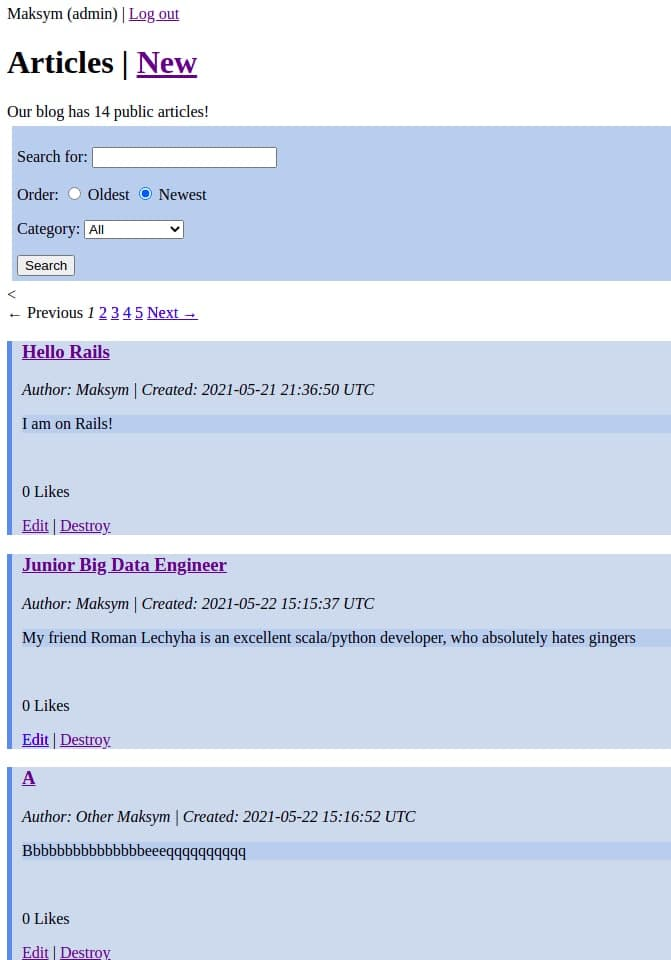

  

+ Article with category Scientific 

  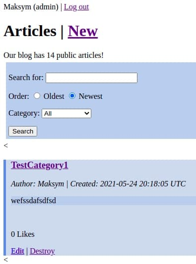

  

+ Creating new article (on photo from local storage)

  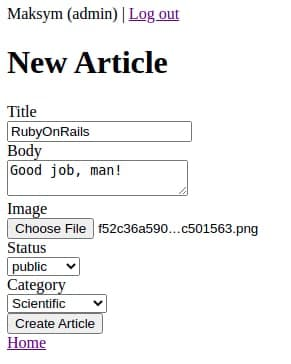

  

  

+ Show article page

  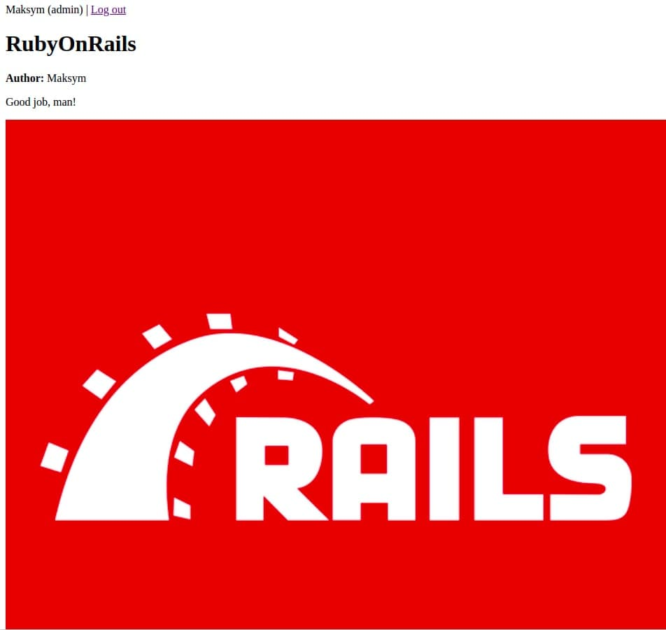

  

+ Likes and comments

  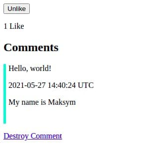

  

+ The new article on the main page 

  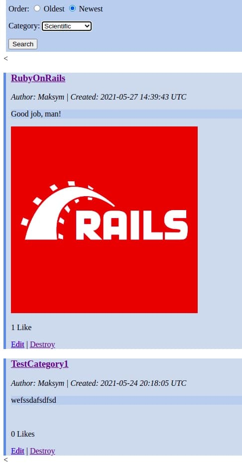

  

+ Search article with "Test" word

  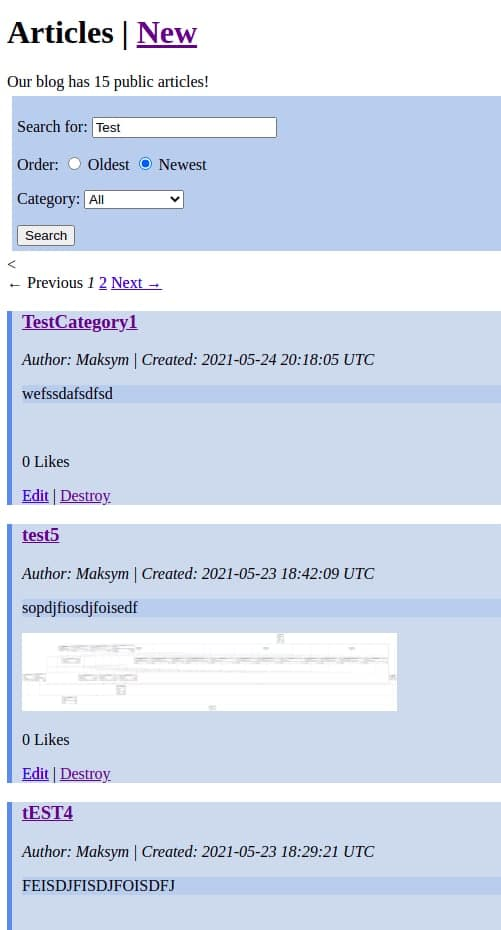

  

+ The photo is stored on a cloud

  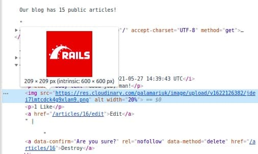

  

+ Admin can edit and destroy all of the articles

  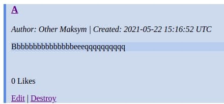

  

+ But user can do it only with its own articles

  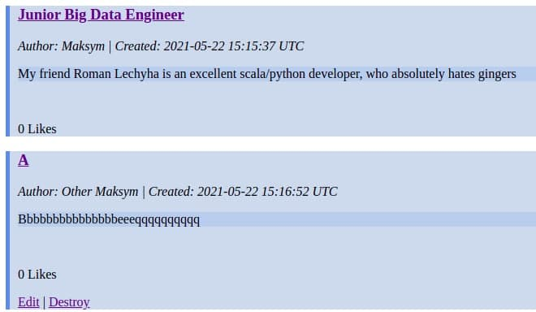

  

+ User also cannot destroy other comments and can add likes

  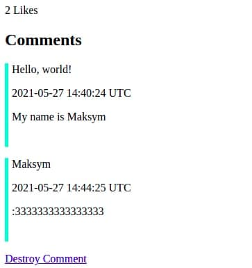
